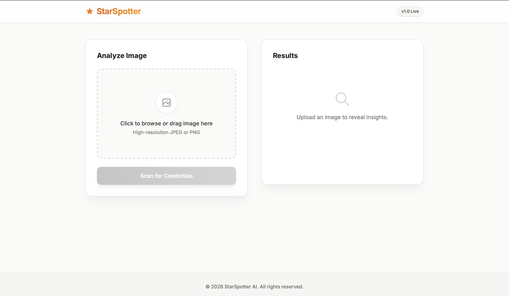
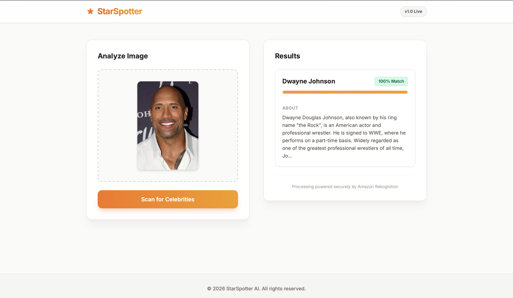

# ⚡ StarSpotter AI: Serverless Multi-Variant Celebrity Recognition Platform

StarSpotter AI is an enterprise-ready, event-driven serverless computer vision platform built entirely on distributed AWS infrastructure. The application features a warm, minimal, glassmorphic dashboard interface that allows users to stage graphic assets and instantly stream deep-learning facial analysis insights—complete with dynamic open-knowledge biographical hydration and secure ephemeral image previews.

---

## 🏗️ Architecture Blueprint

The framework implements a highly available, completely decoupled serverless architecture designed to deliver sub-second response times with zero idle operational costs.

* **Reactive Presentation Layer:** A responsive single-page web application (SPA) styled with modern, warm-toned Tailwind CSS design patterns. It handles localized memory allocation previews via Object URLs and manages asynchronous, secure runtime fetch cycles to the cloud edge.
* **API Routing Proxy:** An Amazon API Gateway (HTTP API v2) proxy cluster configured with explicit global Cross-Origin Resource Sharing (CORS) preflight controls to securely expose the core lambda execution matrices to web traffic.
* **Core Compute Engine:** An isolated AWS Lambda instance running an optimized Python 3.11+ environment that coordinates multi-service backend operations and resolves database serialization type barriers.
* **Computer Vision Intelligence:** An automated AI/ML pipeline powered by Amazon Rekognition that calculates biometric match parameters against a shifting vector library of global public figures.
* **State & Persistence Layers:** A secure object storage core utilizing private Amazon S3 buckets combined with a high-throughput Amazon DynamoDB transactional ledger for permanent analytic footprint logging.

---

## 🛠️ Infrastructure Component Breakdown

| AWS Service | Functional Role inside Pipeline |
| :--- | :--- |
| **AWS Lambda** | Orchestrates query string parsing, triggers AI prediction calls, generates cryptographic asset tokens, and executes strict type conversions. |
| **Amazon API Gateway** | Provides low-latency, auto-scaling access points mapping public web actions to back-end execution runtimes. |
| **Amazon S3** | Maintained under private access blocks to serve as the master file ingestion matrix for incoming target imagery data. |
| **Amazon Rekognition** | Leverages deep convolutional neural networks (CNNs) to parse facial geometry layout hashes and return identity variables. |
| **Amazon DynamoDB** | Persists a transactional execution trail, matching structural lookup properties without indexing overhead. |
| **AWS IAM** | Governs service boundaries by enforcing granular Least-Privilege permissions (`s3:GetObject`, `rekognition:RecognizeCelebrities`, `dynamodb:PutItem`). |

---

## 💻 Technical Design Highlights

### Type Sanitization & Type Conversion Flow
DynamoDB natively blocks standard floating-point numerical types (`float`), forcing developers to store statistical weights as string-mapped `Decimal` classes. However, standard browser serialization tools (`json.dumps`) break when handling `Decimal` objects. To handle this contradiction, the core pipeline routes data via a split-stream structure:
[ Raw Rekognition Precision Output: Float ]
                                  |
             +--------------------+--------------------+
             |                                         |
             v                                         v
[ Safe String Encoding ]                 [ Direct Value Float Map ]
             |                                         |
             v                                         v
[ Decimal(str(MatchConfidence)) ]           [ round(MatchConfidence, 2) ]
             |                                         |
             v                                         v
( Save to Amazon DynamoDB )                ( Return to Browser Client )
